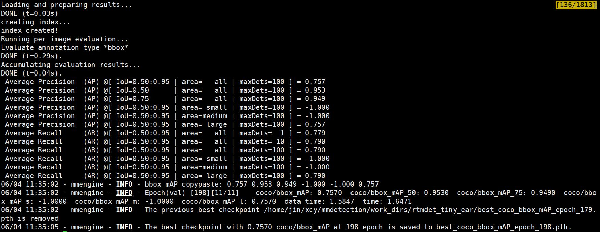
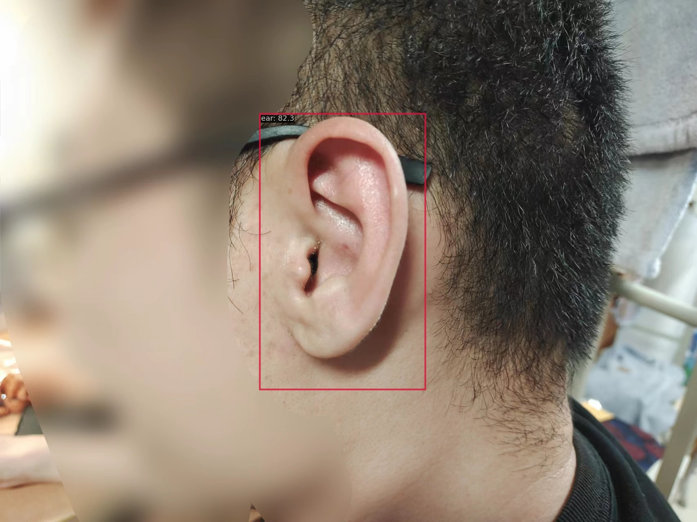
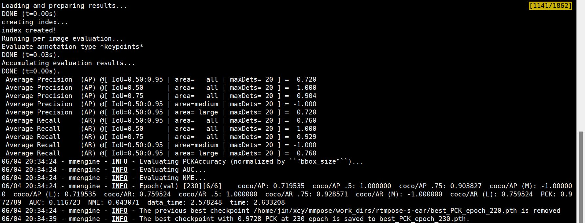
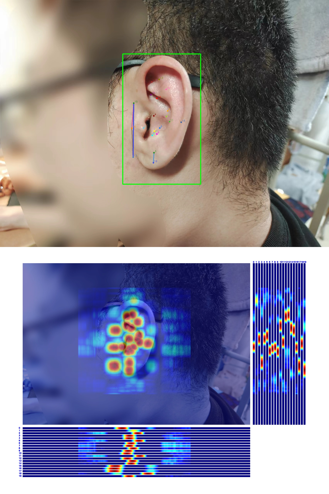

## RTMDet
- config文件:[rtmdet_tiny_ear.py](data/rtmdet_tiny_ear.py)
- 训练日志:[rtmdet_train_log](mmdetection/work_dirs/rtmdet_tiny_ear/20230604_013318/20230604_013318.log)
- 测试集评估指标

- 测试图片

## RTMPose
- config文件:[rtmpose-s-ear.py](data/rtmpose-s-ear.py)
- 训练日志:[rtmpose_train_log](mmpose/work_dirs/rtmpose-s-ear/20230604_134552/20230604_134552.logg)
- 测试集评估指标

- 测试图片

