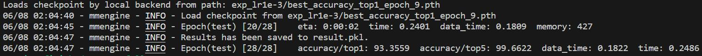
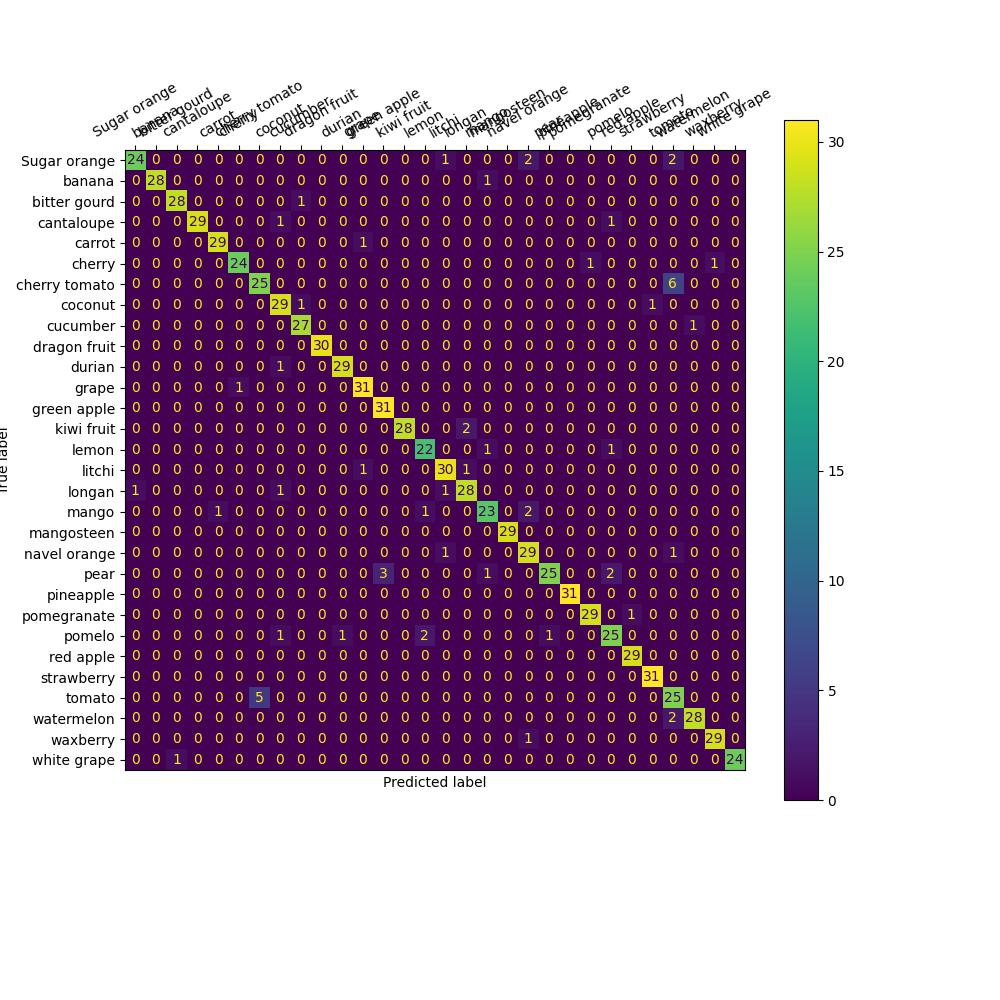

## mmpretrain
- 训练和验证集分割——数据预处理脚本：[data_process.py](data_process.py)
- config文件：[resnet50_finetune.py](mmpretrain/configs/resnet50_finetune.py)
- 训练日志：[train_log](mmpretrain/exp_lr1e-3/20230608_014129/20230608_014129.log)
- 验证集评估指标

- 验证集混淆矩阵分析

- 网图推理结果

- tips:训练过程走了一些弯路，采用lr=0.1（[train_log_lr1e-1](mmpretrain/exp/20230607_232741/20230607_232741.log)）训练发现模型收敛很慢，且在验证集的acc很低，甚至低于resnet50在imagenet上预训练模型的acc，属于踩了finetune学习率调整的坑（[《finetune 学习率要小》](https://blog.csdn.net/u013892042/article/details/107451696)）