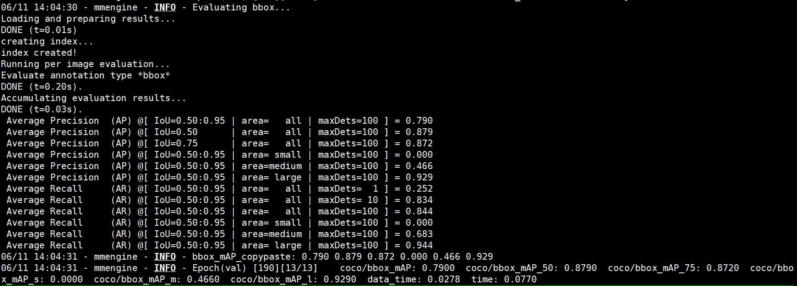
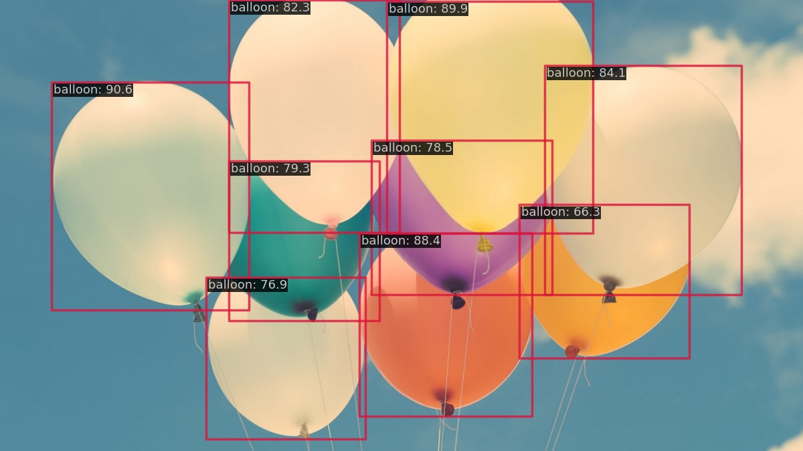

## mmdetection
- 数据预处理：[data_preprocess.ipynb](data_preprocess.ipynb)
- config文件：[rtmdet_balloon.py](mmdetection/configs/rtmdet/rtmdet_balloon.py)
- 训练日志：[train_log](mmdetection/work_dirs/rtmdet_balloon/20230611_132012/20230611_132012.log)
- 验证集评估指标

- 网图推理结果

- 可视化分析：[vis_analyze.ipynb](vis_analyze.ipynb)
