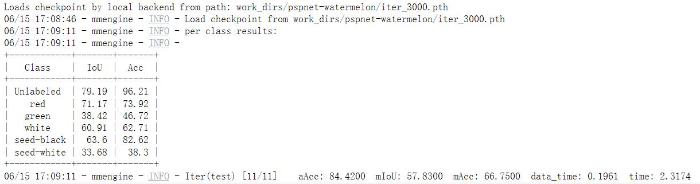

## mmsegmetation
- 数据预处理：[data_preprocess.ipynb](data_preprocess.ipynb)
- 数据可视化：[data_visualization.ipynb](data_visualization.ipynb)
- config文件：[pspnet-watermelon.py](mmsegmentation/pspnet-watermelon.py)
- 训练日志：[train_log](mmsegmentation/work_dirs/pspnet-watermelon/20230615_161656/20230615_161656.log)
- 测试日志：[test_log](mmsegmentation/work_dirs/pspnet-watermelon/20230615_170444/20230615_170444.log)
- 验证集评估指标

- 网图推理结果

- 视频推理结果

